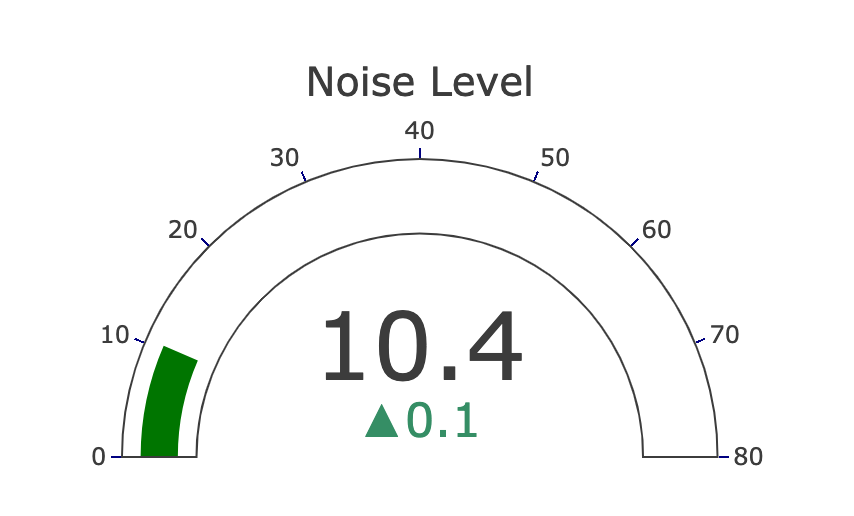
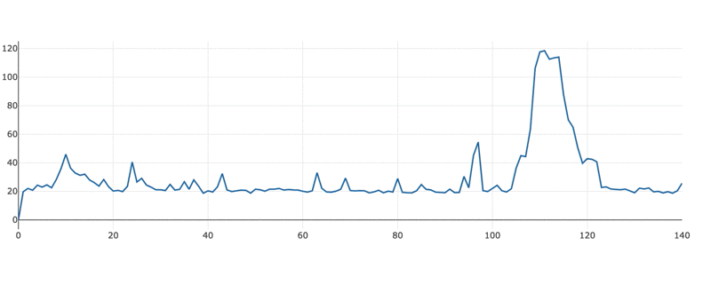

# Noise-o-meter

A sample noise dashboard project as described in this [medium article](https://medium.com/homeday/building-a-noise-level-dashboard-for-your-office-with-a-raspberry-pi-71360ee1ff46?sk=652de93b0eaf5361133f5638970cfde7).


## Setup

Have [mumble](https://github.com/yurivm/mumble) running on the Raspberry PI.

You might need to adjust the following to use your Raspberry Pi's IP:

```
const getWsUri = function() {
  // update the IP here
    let wsHost = $('#hostInput').val() || '192.168.178.30';
    let wsPort = $('#portInput').val() || '8080';
    return "ws://" + wsHost + ":" + wsPort;
  }
```

## How it works

- the WebSocket `onmessage` callback parses JSON messages
- for each JSON message,a `CustomEvent` called `data-received` is dispatched with sound level data
- the event handler collects the data and updates the Plot.ly dashboards


## How it looks





## Contributing

PRs are welcome! :)
